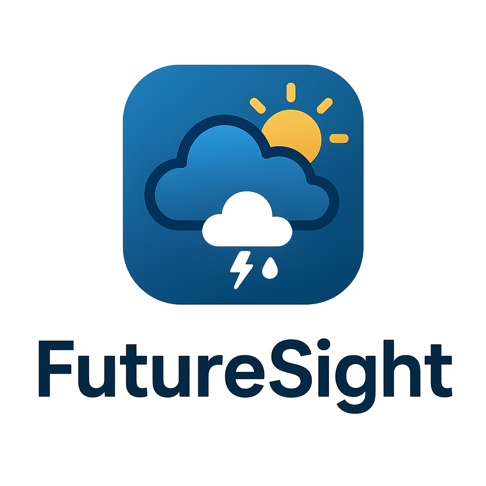

<div align="center">
  
  
  
  <h1>Future Sight: Weather Prediction & Historical Analysis</h1>
  <p><em>A modern web application that provides weather risk prediction and historical analysis using real NASA satellite data.</em></p>
  
  [](https://nasa.gov)
  [](https://reactjs.org/)
  [](https://nodejs.org/)
  [](https://developer.mozilla.org/en-US/docs/Web/JavaScript)
  
  **🚀 Built for NASA SpaceApps Challenge 2025 🚀**
  
  [](https://www.spaceappschallenge.org/)
</div>

---

## 🌟 Overview

Future Sight analyzes weather patterns using NASA Earth Observation data to help users understand future weather conditions and historical probability of specific weather events for any location and date.

### 🏆 NASA SpaceApps Challenge 2025

This project was developed as part of the **NASA SpaceApps Challenge 2025**, addressing the challenge of making NASA Earth observation data more accessible and actionable for everyday decision-making. Our solution transforms complex satellite data into intuitive weather risk predictions that help users plan activities and understand climate patterns.

## ✨ Features

- 🌍 **Location-based Analysis**: Enter city name or coordinates
- 📅 **Date-specific Queries**: Select any day of the year
- 🌡️ **Multiple Weather Variables**: Temperature, humidity, precipitation, wind speed
- ⚖️ **Custom Thresholds**: Define personal risk tolerance levels
- 📊 **Statistical Analysis**: Historical probability and trend calculations
- 📈 **Data Visualization**: Interactive charts and distribution graphs

## 🛠️ Technology Stack

- **Frontend**: React.js with Tailwind CSS ⚛️
- **Backend**: Node.js/Express API 🚀
- **Data Sources**: NASA AIRS (temperature), NASA GLDAS (humidity, precipitation, wind) 🛰️
- **Visualization**: Chart.js 📊
- **Data Processing**: Custom NASA data processors 🔧
- **Visualization**: Chart.js
- **Data Processing**: Custom NASA data processors

## 🚀 Complete Setup Guide

### Prerequisites
Before starting, make sure you have installed:
- **Node.js** (version 16 or higher) - [Download here](https://nodejs.org/)
- **npm** (comes with Node.js)
- **Git** - [Download here](https://git-scm.com/)

### Step 1: Clone the Repository
```bash
git clone https://github.com/akin-bh/future-sight-nasa.git
cd future-sight-nasa
```

### Step 2: Install Dependencies
Install dependencies for both backend and frontend:
```bash
# Install root dependencies (concurrently for running both servers)
npm install

# Install backend dependencies
cd backend
npm install

# Install frontend dependencies
cd ../frontend
npm install

# Return to root directory
cd ..
```

### Step 3: Start the Application

**Option A: Start Both Servers Together (Recommended)**
```bash
# From the root directory, start both backend and frontend
npm run dev
```
This will start:
- **Backend server** on `http://localhost:3001` 
- **Frontend application** on `http://localhost:3000`

**Option B: Start Servers Separately**
```bash
# Terminal 1: Start backend server
cd backend
npm start
# Backend runs on http://localhost:3001

# Terminal 2: Start frontend (in new terminal)
cd frontend
npm start
# Frontend runs on http://localhost:3000
```

### Step 4: Access the Application
1. **Open your browser** and go to `http://localhost:3000`
2. **The application should load** with the Future Sight interface
3. **Backend API** is accessible at `http://localhost:3001`

### 🔧 Troubleshooting

**If you get port conflicts:**
- Backend port 3001 is busy: Kill existing Node processes or change port in `backend/index.js`
- Frontend port 3000 is busy: React will automatically suggest port 3001, type `y` to accept

**If npm install fails:**
```bash
# Clear npm cache and retry
npm cache clean --force
rm -rf node_modules package-lock.json
npm install
```

**If the application doesn't load:**
1. Check both servers are running (you should see startup messages)
2. Check browser console for errors (F12 → Console tab)
3. Verify both `http://localhost:3000` and `http://localhost:3001` are accessible

### 📊 How to Use the Application

1. **Enter a Location**: Type a city name (e.g., "New York", "London")
2. **Select Date**: Choose month and day for analysis
3. **Choose Weather Variable**: Temperature, Humidity, Precipitation, or Wind Speed
4. **Set Threshold**: Define your risk tolerance level
5. **Get Analysis**: View historical probability and statistics
6. **Explore Visualizations**: Check charts and distribution graphs

## Project Structure

```
NASA/
├── frontend/               # React application
│   ├── src/
│   │   ├── components/     # UI components
│   │   ├── hooks/         # Custom React hooks
│   │   └── utils/         # Helper functions
│   └── package.json
├── backend/               # Node.js API server
│   ├── index.js          # Main server file
│   ├── *Processor.js     # NASA data processors
│   └── package.json
├── data/                 # NASA satellite data files
└── docs/                 # API documentation
```


### Available Scripts
```bash
# Root directory
npm run dev          # Start both servers
npm run backend      # Start only backend
npm run frontend     # Start only frontend
npm run build        # Build frontend for production

# Backend directory
npm start           # Start backend server
npm run dev         # Start with nodemon (auto-restart)

# Frontend directory
npm start           # Start development server
npm run build       # Build for production
npm test            # Run tests
```

## 📝 Project Architecture

### Backend Structure
- **`index.js`**: Main server file with Express setup
- **`routes/`**: API endpoint handlers
- **`services/`**: NASA data integration services
- **`utils/`**: Statistical calculation utilities
- **`*Processor.js`**: NASA data processing modules

### Frontend Structure
- **`components/`**: React UI components
- **`hooks/`**: Custom React hooks (useHistoricalData)
- **`utils/`**: Helper functions and utilities
- **`index.js`**: Main React application entry point

## Data Sources

This application uses authentic NASA satellite data:

- **Temperature**: NASA AIRS/Aqua L3 Monthly Standard Physical Retrieval
- **Humidity**: NASA GLDAS Noah Land Surface Model (Specific Humidity)
- **Precipitation**: NASA GLDAS Noah Land Surface Model (Precipitation Rate)  
- **Wind Speed**: NASA GLDAS Noah Land Surface Model (Near Surface Wind Speed)

All data accessed through NASA Giovanni interface with 10+ years coverage (2015-2025).

## NASA Data Access

- [NASA Earthdata](https://earthdata.nasa.gov/) - Main data portal
- [Giovanni Interface](https://giovanni.gsfc.nasa.gov/) - Data analysis tool
- [AIRS Mission](https://airs.jpl.nasa.gov/) - Temperature data source
- [GLDAS Project](https://ldas.gsfc.nasa.gov/gldas/) - Land surface data

---

## 🚀 NASA SpaceApps Challenge 2025

### Challenge Theme: **"Earth Science & Climate Change"**

Future Sight was developed for the **NASA SpaceApps Challenge 2025**, one of the world's largest global hackathons focused on space exploration and Earth science. This project addresses the challenge of making NASA's vast Earth observation datasets accessible and actionable for everyday users.

### 🎯 Problem Statement
How can we transform complex NASA satellite data into user-friendly tools that help people make informed decisions about weather-sensitive activities?

### 💡 Our Solution
Future Sight bridges the gap between advanced NASA Earth observation data and practical decision-making by:

- **Democratizing NASA Data**: Making AIRS and GLDAS datasets accessible to non-scientists
- **Predictive Analytics**: Using historical patterns to predict future weather risks
- **User-Centric Design**: Intuitive interface for location-based weather analysis
- **Real-World Applications**: Helping users plan outdoor activities, travel, and events

### 🏆 Innovation Highlights

1. **NASA Data Integration**: Direct integration with official NASA AIRS and GLDAS datasets
2. **Statistical Modeling**: Advanced probability calculations based on 10+ years of satellite data
3. **Interactive Visualizations**: Chart.js powered graphs for data interpretation
4. **Responsive Design**: Works seamlessly across desktop and mobile devices
5. **Open Source**: Fully documented codebase for community contribution

### 🌍 Impact & Applications

- **Event Planning**: Help organizers assess weather risks for outdoor events
- **Agriculture**: Assist farmers in planning planting and harvesting schedules
- **Travel**: Enable travelers to make informed decisions about destinations
- **Research**: Provide accessible historical climate data for educational purposes
- **Emergency Preparedness**: Support communities in understanding weather patterns

### 🔗 SpaceApps Resources

- [NASA SpaceApps Challenge 2025](https://www.spaceappschallenge.org/)
- [NASA Earth Science Data](https://earthdata.nasa.gov/)
- [Project Repository](https://github.com/akin-bh/future-sight-nasa)

---

<div align="center">
  <h3>🛰️ Built with NASA Data • Made for SpaceApps 2025 • Open Source 🛰️</h3>
  <p><em>Transforming space data into earthly solutions</em></p>
</div>


